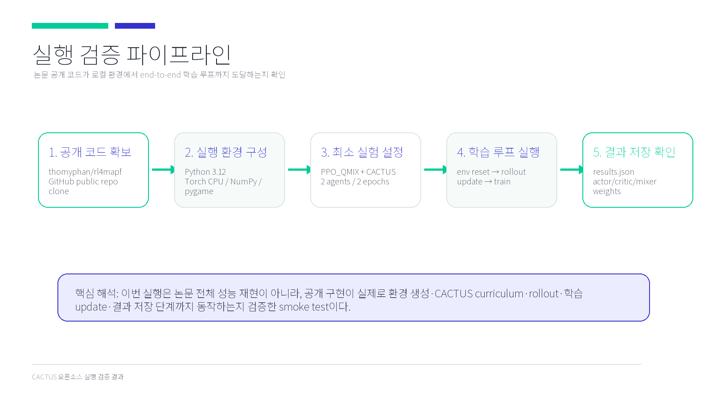
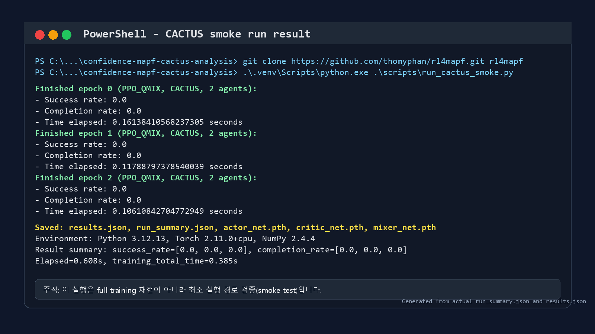
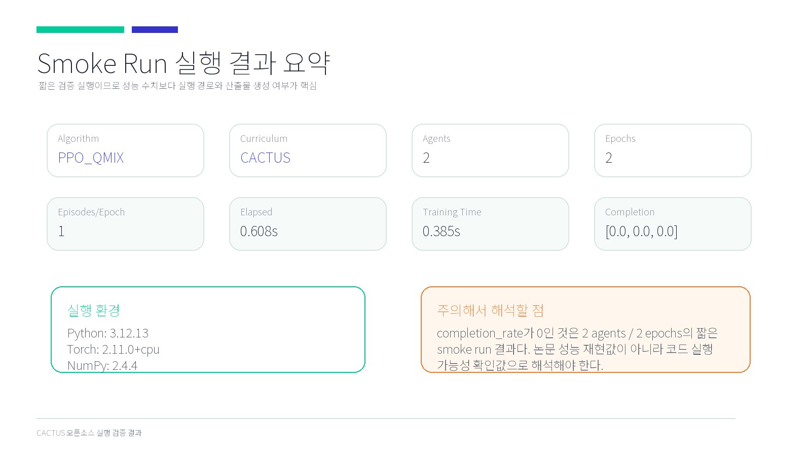
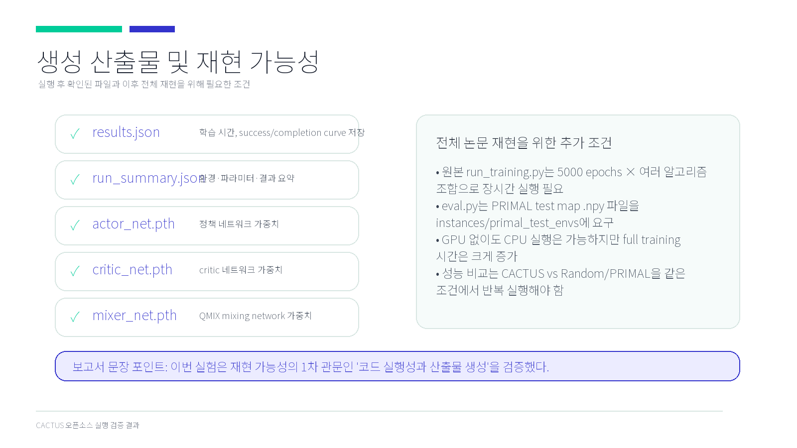

# CACTUS 오픈소스 코드 실행 결과 보고서

## 1. 실행 목적

본 보고서는 논문 **Confidence-Based Curriculum Learning for Multi-Agent Path Finding**의 공개 GitHub 구현체가 실제로 실행 가능한지 확인한 결과를 정리한 것이다.

이번 실행은 논문 전체 성능을 재현하는 full training이 아니라, 공개 코드가 다음 경로까지 정상 동작하는지 확인하는 **smoke test**이다.



## 2. 내가 실행한 것

대상 공개 코드:

- 원본 저장소: <https://github.com/thomyphan/rl4mapf>
- 본 보고서 저장소: <https://github.com/kekim43-cmd/confidence-mapf-cactus-analysis>

내가 실행한 스크립트:

```powershell
.\.venv\Scripts\python.exe .\scripts\run_cactus_smoke.py
```

실행 설정:

| 항목 | 값 |
|---|---|
| 알고리즘 | PPO_QMIX |
| Curriculum | CACTUS |
| Agent 수 | 2 |
| Epoch 수 | 2 |
| Episodes per epoch | 1 |
| Map size | 6 |
| Time limit | 12 |
| 목적 | 논문 전체 재현이 아닌 최소 실행 경로 검증 |

## 3. 실행 결과 화면

아래 이미지는 로컬에서 실행한 결과 화면을 보고서용으로 정리한 것이다.



실행 결과 요약:

| 항목 | 결과 |
|---|---|
| 전체 elapsed time | 0.608초 |
| training total time | 0.385초 |
| success_rate | `[0.0, 0.0, 0.0]` |
| completion_rate | `[0.0, 0.0, 0.0]` |
| 생성 결과 파일 | `results.json`, `run_summary.json`, `actor_net.pth`, `critic_net.pth`, `mixer_net.pth` |



`success_rate`와 `completion_rate`가 0으로 나온 것은 성능 실패를 의미하지 않는다. 이번 실행은 2 agents, 2 epochs의 매우 짧은 smoke run이므로, 학습 성능을 평가하기 위한 실험이 아니다. 이 결과는 공개 코드가 환경 생성, rollout, 학습 update, 결과 저장 단계까지 정상적으로 실행되는지를 확인한 값이다.

## 4. 생성된 산출물

실행 후 다음 파일이 생성되는 것을 확인하였다.

| 파일 | 의미 |
|---|---|
| `results.json` | success rate, completion rate, training time 저장 |
| `run_summary.json` | 실행 환경, 파라미터, 결과 요약 |
| `actor_net.pth` | policy actor 가중치 |
| `critic_net.pth` | critic network 가중치 |
| `mixer_net.pth` | QMIX mixing network 가중치 |



## 5. 교수님이 직접 실행하는 방법

Windows PowerShell 기준 실행 방법은 다음과 같다.

```powershell
git clone https://github.com/kekim43-cmd/confidence-mapf-cactus-analysis.git
cd confidence-mapf-cactus-analysis

git clone https://github.com/thomyphan/rl4mapf.git rl4mapf

python -m venv .venv
.\.venv\Scripts\python.exe -m pip install -r requirements.txt
.\.venv\Scripts\python.exe .\scripts\run_cactus_smoke.py
```

macOS/Linux 환경에서는 마지막 두 줄을 다음처럼 바꾸면 된다.

```bash
python3 -m venv .venv
./.venv/bin/python -m pip install -r requirements.txt
./.venv/bin/python ./scripts/run_cactus_smoke.py
```

실행이 성공하면 `cactus_smoke_output/quick-run-.../` 폴더 아래에 다음 파일들이 생성된다.

```text
results.json
run_summary.json
actor_net.pth
critic_net.pth
mixer_net.pth
```

## 6. 실행 환경

내가 실행한 환경은 다음과 같다.

| 항목 | 버전 |
|---|---|
| Python | 3.12.13 |
| PyTorch | 2.11.0+cpu |
| NumPy | 2.4.4 |
| pygame | 2.6.1 |

## 7. 주의할 점

원본 저장소의 `run_training.py`는 논문 실험용 장시간 학습 스크립트이다. 기본 설정은 5000 epochs와 여러 알고리즘 조합을 순차 실행하므로, 일반 노트북에서 바로 돌리기에는 시간이 오래 걸린다.

또한 원본 `eval.py`는 PRIMAL test map `.npy` 파일을 요구한다. 이 파일은 원본 GitHub 저장소에 포함되어 있지 않으므로, 논문 평가 결과 전체를 그대로 재현하려면 별도 테스트 맵 자료를 받아 `instances/primal_test_envs`에 배치해야 한다.

## 8. 프로젝트와의 연결

이 논문은 스마트팩토리 MCS-RTD 통합 제어 플랫폼의 **AI 경로 최적화 모듈**과 직접적으로 연결된다.

- RTD 룰 빌더: 작업 우선순위와 목표 할당 조건을 생성
- MCS 반송 제어: agent 위치, 충돌 제약, 실행 명령을 관리
- CACTUS/MARL: 시뮬레이션에서 동적 경로 정책을 학습
- 통합 대시보드: completion, congestion, collision risk를 모니터링


## 9. 결론

이번 실험은 논문 전체 성능 재현이 아니라 공개 구현체의 실행 가능성 검증을 목표로 수행하였다. 최소 설정의 smoke run을 통해 CACTUS curriculum, PPO_QMIX controller, MAPF 환경 rollout, 학습 update, 결과 및 가중치 저장이 정상적으로 이어지는 것을 확인하였다.

따라서 해당 오픈소스는 프로젝트의 AI 경로 최적화 모듈을 설계하고 분석하는 출발점으로 활용 가능하다.

